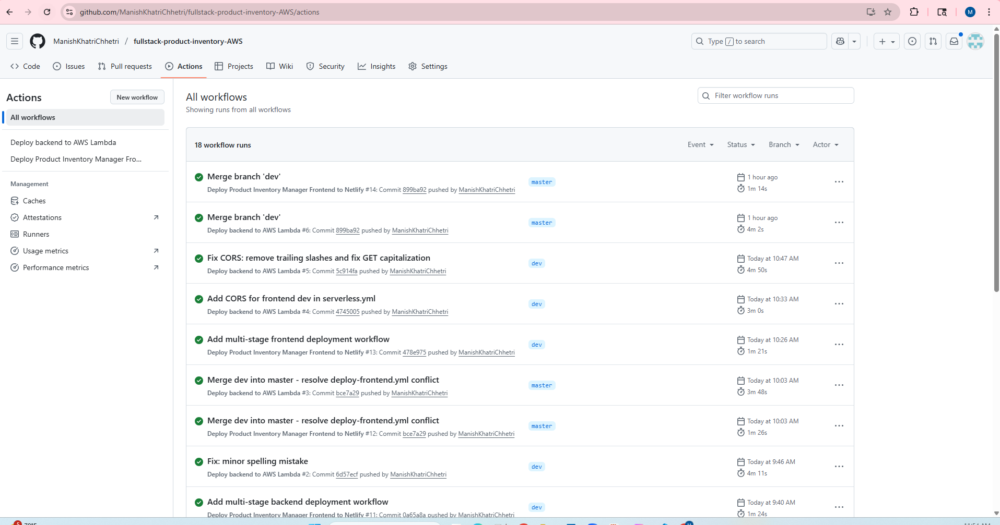
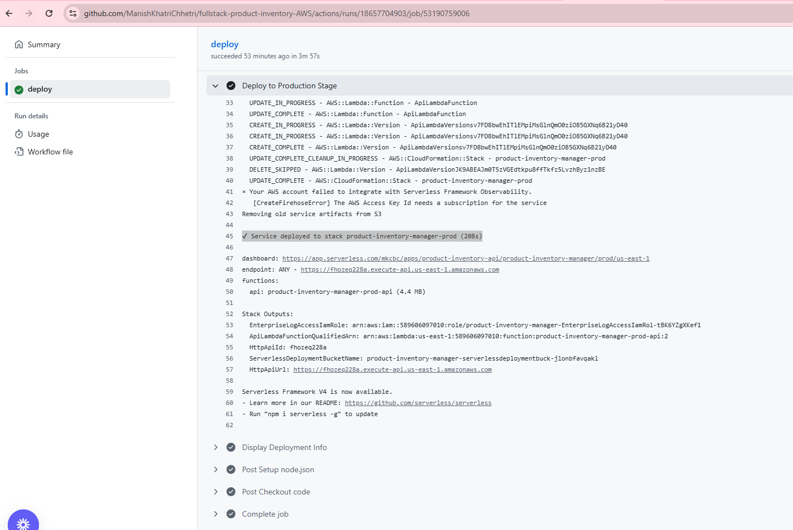
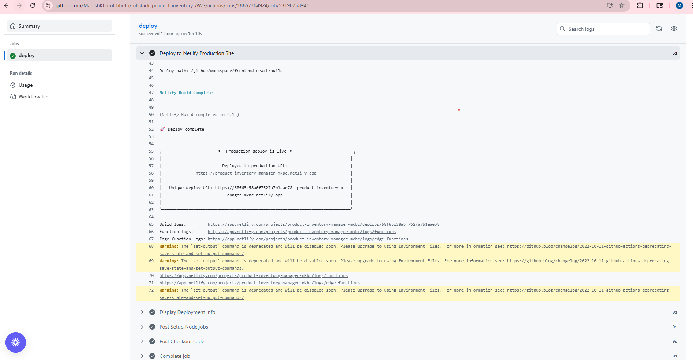

# Product Inventory Manager

Full-stack serverless CRUD application with AWS Lambda, DynamoDB, React, and automated multi-stage CI/CD deployments.

## 🚀 Live Demo

- **Production:** [https://product-inventory-manager-mkbc.netlify.app](https://product-inventory-manager-mkbc.netlify.app)
- **Development:** [https://dev-product-inventory-manager-mkbc.netlify.app](https://dev-product-inventory-manager-mkbc.netlify.app)

📹 **[Video Walkthrough](https://www.loom.com/share/7db54d968fe84bcf910d02e995057325)**

---

## 🏗️ Architecture

**Backend:** Serverless Framework + AWS Lambda (Node.js 20.x) + API Gateway + DynamoDB  
**Frontend:** React 19 + Material-UI  
**CI/CD:** GitHub Actions (multi-stage: dev/prod)

```
React (Netlify) → API Gateway → Lambda → DynamoDB
```

---

## ✨ Features

- Full CRUD operations (Create, Read, Update, Delete)
- Multi-stage deployments (separate dev & prod environments)
- Responsive design (mobile/tablet/desktop)
- Automated CI/CD with GitHub Actions
- Infrastructure as Code (Serverless Framework)

---

## 🚦 CI/CD Pipeline

**Workflow:** Push to `dev` → Deploy to DEV | Merge to `master` → Deploy to PROD

**Backend:** Deploys Lambda, API Gateway, DynamoDB to AWS  
**Frontend:** Builds React app and deploys to Netlify

### Screenshots





---

## 🚀 Quick Start

### Prerequisites
Node.js 18+, AWS Account, Serverless Account, Netlify Account

### Local Setup

```bash
# Backend
cd backend-serverless && npm install
npm install -g serverless@3
serverless login
npm run dev

# Frontend (new terminal)
cd frontend-react && npm install
npm start
```

---

## 📡 API Endpoints

**Base URL (Dev):** `https://5iuovjt7z2.execute-api.us-east-1.amazonaws.com`

| Method | Endpoint | Description |
|--------|----------|-------------|
| GET | `/products` | Get all products |
| POST | `/products` | Create product |
| PUT | `/products/:id` | Update product |
| DELETE | `/products/:id` | Delete product |

---

## 🔐 GitHub Secrets Required

**Backend:** `SERVERLESS_ACCESS_KEY`  
**Frontend:** `NETLIFY_AUTH_TOKEN`, `NETLIFY_SITE_ID_DEV`, `NETLIFY_SITE_ID_PROD`, `REACT_APP_API_URL_DEV`, `REACT_APP_API_URL_PROD`

---

## 📦 Deployment

**Dev:**
```bash
git checkout dev
git push origin dev
```

**Prod:**
```bash
git checkout master
git merge dev && git push origin master
```

---

## 🛠️ Tech Stack

AWS Lambda, API Gateway, DynamoDB, Serverless Framework, React, Material-UI, GitHub Actions, Netlify

---

## 👨‍💻 Author

**Manish Khatri Chhetri**  
GitHub: [@ManishKhatriChhetri](https://github.com/ManishKhatriChhetri) | Email: manish.studycs@example.com

---

**Last Updated:** October 20, 2025